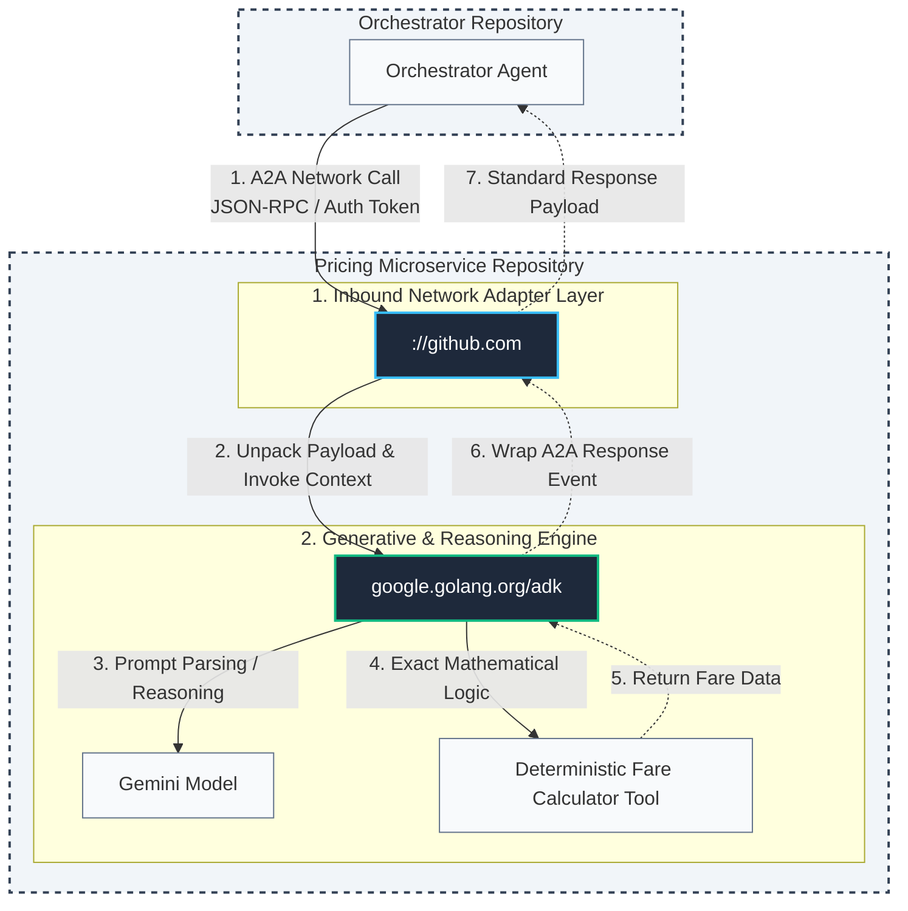

# Travel Fare Engine – Architecture Decision Record (ADR)

## 1. Purpose

A standalone A2A microservice that computes travel fare quotes. It is the pricing half of a two‑repo system; the orchestrator half will call this service over A2A.



## 2. Core Principles

- **Deterministic core, LLM‑as‑wrapper** – All math lives in pure Go functions, never in the LLM.
- **Two‑step agent pipeline** –
  - Step 1: tool‑calling LLM that validates and calls the pricing function.
  - Step 2: formatter LLM with structured output (no tools) that transcribes the result into a schema‑validated `FareQuote`.
- **Boundary contract is the only shared truth** – Input/output Pydantic‑style structs; no shared imports between repos.
- **Statelessness** – No persistence, no inventory, no session affinity.
- **Tripwire tests** – Enum vocabularies are duplicated intentionally across repos; a CI test fails if they drift.
- **Evaluation‑gated CI/CD** – Deploy only if eval suite passes.

## 3. Boundary Contract (A2A)

### Input: `FareQuoteRequest`

| Field                   | Type               | Constraints                                       | Rationale                                                                      |
| ----------------------- | ------------------ | ------------------------------------------------- | ------------------------------------------------------------------------------ |
| `base_distance_miles`   | `int`              | `ge=100, le=10000`                                | Orchestrator derives from airports; engine needs a pure number.                |
| `advance_purchase_days` | `int`              | `ge=0, le=365`                                    | Drives yield curves; matches the `rate_lock_days` concept.                     |
| `passengers`            | `[]PassengerGroup` | min 1 group, total count ≤ 9                      | Array chosen for clean domain modeling; flatten if Go ADK tooling requires it. |
| `cabin_class`           | `string`           | `economy`, `premium_economy`, `business`, `first` | Tripwire vocabulary.                                                           |
| `booking_class`         | `string`           | `Y`, `B`, `M`, `H`, `Q`, `G`, `K` (7 values)      | Fuel for lookup tables; more variants = richer testing.                        |
| `route_type`            | `string`           | `domestic`, `international`                       | Drives tax tables; the engine never knows actual airports.                     |
| `season_code`           | `string`           | `low`, `shoulder`, `peak`                         | Drives seasonal surcharge; orchestrator determines from date.                  |

**`PassengerGroup`:**

- `count` (int, 1‑9)
- `type` (string, `adult` | `child` | `infant`)

### Output: `FareQuote`

- `base_fare`, `taxes` (list of `TaxLineItem`), `total_fare`, `currency`, `booking_class`, `fare_basis_code`, `fare_rules` (refundable, changeable, advance purchase min), `pricing_breakdown` ([]string), `quote_id`, `expires_at`.

The structured output crosses A2A directly—no prose wrapper.

## 4. What the Engine Validates (and Why)

**Rejects:**

1. Empty `passengers` array – cannot price zero entities (mathematical null operation).
2. Total passenger count > 9 (sum across all groups) – contract cap (`MaxTotalPassengers`). Per-group counts are also bounded to 1–9.
3. Unknown `type` or `booking_class` – tripwire enforcement of the A2A contract.
4. Illegal `booking_class` + `advance_purchase_days` combination – every restricted class is enforced from a single source of truth (`BookingAdvancePurchaseMin`: G ≥ 21, Q ≥ 14, K ≥ 7). The same map feeds the `advance_purchase_min` advertised in `fare_rules`, so the enforced minimum and the advertised minimum can never drift.

**Does NOT reject:**

- Any mix of passenger types (e.g., 0 adults, 1 infant) – the engine can compute infant fare as a derivative of the route’s adult base fare. No business policy.
- Non‑sensical but mathematically valid requests – policy enforcement belongs to the orchestrator.

## 5. Deterministic Pricing Design

- `engine.go` `Calculate()` is pure Go: no I/O, no network, no LLM.
- Lookup tables in `tables.go` cover:
  - Base fare = `distance * per_mile_rate`, where rate depends on `cabin_class`, `booking_class`, `season_code`, `route_type`.
  - Advance‑purchase discount factor (curve keyed by days).
  - Infant fare = `adultBaseFare * 0.10` (lap infant); child fare = `adultBaseFare * childFactor`.
  - Tax tables keyed by `route_type` and passenger type (domestic: US tax; international: various departure/arrival taxes).
- `fare_basis_code` is synthesized deterministically from inputs (e.g., `MLXNN1N`).
- `expires_at` is `now + QuoteValidityWindow` (a short, fixed fare-hold window — currently 24h). It is deliberately **independent** of `advance_purchase_days`, which only affects pricing. Tying the hold window to advance-purchase days would make a same-day request (`advance_purchase_days=0`) expire instantly and a far-future request stay "valid" for up to a year.

## 6. LLM Agent Architecture (Go ADK)

- `SequentialAgent` with two sub‑agents:
  1. **PricingAgent** – `LlmAgent` with `FunctionTool(compute_fare)`. Instruction forbids the LLM from computing prices. The tool returns a `dict` matching `FareQuote`.
  2. **FormatterAgent** – `LlmAgent` with `output_schema=FareQuote` (or equivalent). No tools. Transcribes the dict into the final validated struct.
- Model: `gemini-2.5-flash` (no reasoning needed; cost/latency sensitive).

## 7. Agent Discovery (Agent Card)

- Static `agent-card.json` at repo root, served at `/.well-known/agent-card.json`.
- Contains: agent `name`, `description`, `version`, and the `compute_fare_quote` skill with input shape.
- Synchronized with code by a build‑time test.

## 8. Project Structure

```
travel-fare-engine/
├── agent-card.json            # static A2A card (served at /.well-known)
├── go.mod / go.sum
├── eval/                      # PLANNED (not yet implemented) — custom eval harness
│   ├── cases.json
│   ├── integration_test.go    # optional: go test based
│   └── README.md
├── cmd/
│   └── server/
│       ├── main.go            # wires SequentialAgent + A2A launcher
│       └── prompts.go         # instruction strings for pricing & formatter agents
└── internal/
    └── domain/
        └── fare/
            ├── schema.go      # structs with validation tags
            ├── engine.go      # pure Calculate() + tripwire validation
            ├── tables.go      # static fare matrices
            └── engine_test.go # table‑driven unit tests
```

## 9. Testing & CI/CD

- **Unit tests** (`engine_test.go`): table‑driven coverage of `Calculate` for all boundary inputs.
- **Tripwire test**: enumerates allowed enum values; fails if any missing.
- **Eval harness** (`eval/`): integration tests that spin up the full server (with mock LLM or dedicated eval model) and assert structured output matches hand‑computed expected values.
- **CI**: PR → unit tests → evals (gated on relevant paths) → merge → deploy to Cloud Run with `--no-allow-unauthenticated`.
- **No service account keys**; authentication via Workload Identity Federation.

## 10. Known Simplifications (to be addressed in production)

- The `eval/` harness described in §8 (cases.json, integration tests, README) is **not yet implemented**. The "evaluation‑gated CI/CD" in §2/§9 is therefore aspirational; current automated coverage is the unit + tripwire tests under `internal/domain/fare/`.
- No real‑time pricing data; all fares from static tables.
- No quote persistence; quote IDs returned for orchestrator’s audit trail only.
- Taxes are approximate; a full implementation would require airport‑specific fees and stopover logic.
- No fair‑lending / compliance review for fare adjustments (in a real travel system, this would be required).
- All monetary values use float64 and are rounded to 2 decimal places. In a production system, integer cents or a decimal library would eliminate floating‑point drift.

## 11. Cloud Run Ingress Decision

**Choice:** `--ingress all` + `--no-allow-unauthenticated`

**Rationale:**

- The CI smoke test runs on GitHub‑hosted runners, outside the project VPC.
- With `--ingress internal`, the smoke test cannot reach the Cloud Run service.
- Widening to `all` removes the VPC‑only constraint, but the service still requires a valid identity token.
- This mirrors the mortgage‑rate‑engine’s documented trade‑off (see its README Known Gaps).

**Known Gap:**
For a stricter posture, move the smoke test inside the project (e.g., a Cloud Run Job) and restore `--ingress internal`. This is deferred as a future improvement.

## 12. Deployment & IAM Pattern

**Containerization**

- The service is shipped as a single Go binary in a distroless or slim container.
- Port is read from `$PORT` (Cloud Run default), with 8081 as a local default to avoid collision with the orchestrator.

**Cloud Run security posture**

- `--no-allow-unauthenticated` – all calls require an identity token.
- `--ingress all` – widens reachability for the CI smoke test (see §11), but auth is still mandatory.
- The service runs as a dedicated service account (`travel-fare-engine-sa`) with no permissions beyond what’s needed (no database, no storage).

**Orchestrator invocation identity**

- The orchestrator (in a separate repo) uses its own service account.
- That SA is granted `roles/run.invoker` on this engine’s Cloud Run service.
- The orchestrator obtains an identity token for its SA and attaches it to every A2A call.

**CI/CD authentication**

- GitHub Actions uses Workload Identity Federation (WIF) – no service account keys in the repo or GitHub secrets.
- The deploy SA’s IAM grants include `roles/storage.admin` (for the source bucket), `roles/iam.serviceAccountUser` (on the runtime SA), and Cloud Build‑related permissions, mirroring the mortgage‑rate‑engine setup.

**Known gaps** (extended from §10)

- The CI smoke test runs from a GitHub‑hosted runner outside the VPC, which forced `--ingress all`. Moving the smoke test inside the project would allow `--ingress internal`.
- Automated rollback on smoke-test failure is not implemented; Cloud Run retains the last healthy revision, but the failed revision must be cleaned up manually.

## 13. Stack

| Component           | Summary                           |
| :------------------ | :-------------------------------- |
| **Language**        | Go 1.26.4                         |
| **Agent Framework** | `google.golang.org/adk` (a2a‑go)  |
| **Model**           | gemini‑2.5‑flash                  |
| **Transport**       | A2A JSON‑RPC 2.0                  |
| **Schema**          | Go structs + `encoding/json` tags |

---

## What the engine does without an LLM

The Go code (`fare.Calculate`) is pure math. It needs a structured `FareQuoteRequest` as input and it returns a structured `FareQuote`. We could absolutely wrap that in a simple REST endpoint (POST JSON, get JSON back), and it would work perfectly.

## Why the masterclass adds an LLM agent on top

The LLM doesn’t do pricing. It does **three things the pure function can’t**:

1. **Natural-language → structured input**  
   The orchestrator might say: _“Get me a fare for 2500 miles, economy, departing in 30 days.”_  
   The LLM parses that free text into the exact `FareQuoteRequest` fields. Without it, the orchestrator must always send perfectly‑shaped JSON. That’s fine for a programmatic call, but it makes the engine useless in a conversational agent pipeline where the input arrives as human language.

2. **Structured output → human‑readable summary**  
   The mortgage engine returns a `RateQuote` **and** a one‑sentence summary. The formatter does the same. The orchestrator can show that summary directly to a user or log it for audit. Without the LLM, you’d return pure numbers, and the orchestrator would need its own formatting logic.

3. **Contract enforcement on the wire**  
   The A2A protocol expects an agent, not a plain REST function. By wrapping your engine as an agent, it becomes discoverable via the agent card, callable via A2A, and composable into larger agent pipelines. The orchestrator doesn’t need to know about your internal `Calculate` function — it just sees another agent it can talk to.

## Could you do it without the LLM? Yes.

If our orchestrator always produces a machine‑formatted `FareQuoteRequest` (not natural language), you can remove the LLM layer entirely and serve a pure JSON API. That’s a valid architectural choice. The mortgage engine keeps the LLM because:

- The orchestrator is **also** an LLM‑based agent, so the two communicate in a way that matches their internal reasoning (natural language → tool call → structured output).
- It makes the engine **standalone and reusable** in any agentic system that speaks A2A, not just your specific orchestrator.
- It demonstrates a **pattern** (LLM‑as‑wrapper) that is essential for systems where the input isn’t perfectly structured — e.g., when a human types a request in a chatbot.

## The trade-off

| Approach                        | Pros                                                                                                 | Cons                                                                            |
| ------------------------------- | ---------------------------------------------------------------------------------------------------- | ------------------------------------------------------------------------------- |
| **Pure REST** (no LLM)          | Fast, cheap, zero LLM cost                                                                           | Only works with structured callers; no conversational ability; no A2A discovery |
| **LLM agent wrapper** (current) | Works with natural language; A2A‑compatible; summarises output; demonstrates the masterclass pattern | Small LLM cost (~cents); slightly higher latency                                |

We choose the wrapper **because the boundary is A2A**, not REST. The two‑repo system assumes the orchestrator is an agent, so the pricing component must speak the same language (literally and protocol‑wise).

If we want to prove the concept without the LLM, we can always serve a parallel `/api/calculate` endpoint alongside the A2A one. But the agent path is what makes the system a **learned pattern from the reference project**, not just a function in a cloud container.

Your skepticism is sharp and exactly right: **if the engine only ever gets called by another machine with a perfectly structured JSON, then the LLM layer is wasteful.** You could just expose `Calculate` over a simple REST endpoint and call it a day.

The masterclass project _chooses_ the LLM wrapper not because the math needs it, but because the **architecture needs it**. Let me break down the real reasons—and then I’ll tell you where the line is between ceremony and genuine value.

---

## 1. The LLM agent is the **A2A contract implementation**, not just a function call

The A2A protocol (JSON‑RPC over HTTP) is what the two repos agree on. The orchestrator sends a `message/send` with a user‑role part, and the engine responds with a structured result. If you took the LLM out, you’d need to invent your own wire format, your own error codes, your own discovery, and your own serialization for every possible language. The LLM agent is a **pre‑built implementation of that protocol**—it handles parsing, tool dispatch, and response formatting according to a discoverable schema.

You _could_ build that protocol by hand in Go. But then you’d be writing your own A2A server from scratch, which is what we tried to avoid. The LLM agent is the **off‑the‑shelf A2A server** that happens to use an LLM internally.

---

## 2. The two‑step pipeline catches schema violations that pure REST would miss

With a plain REST endpoint, if the orchestrator sends `{"cabin_class": "econmy"}` (a typo), your Go code returns a 400 with a validation error. The orchestrator must then parse that error string, figure out what went wrong, and maybe retry. That’s brittle.

With the LLM tool‑calling step, the orchestrator can send natural language—even a garbled version—and the LLM will **map it to the correct tool call** using the function declaration. It will coerce `"econmy"` to `"economy"` because the enum is in the schema. The LLM acts as a fuzzy input normalizer at the boundary. That’s a real engineering win: the engine becomes robust to slightly malformed input from human‑like sources.

The formatter step then guarantees the output is the exact schema. Together, the two agents provide **defense in depth** at the contract boundary.

---

## 3. The separate service is about **trust and deployability**, not code reuse

Why not just run `Calculate` inside the orchestrator? Because in a real system:

- **The pricing logic is audited and regulated.** You want to prove that the code deployed in the pricing service hasn’t changed since the last compliance review. If it were mixed with orchestrator code, every orchestrator deploy would require re‑certification.
- **The engine runs with minimal IAM permissions** (only invoke, no database access). If it were part of the orchestrator, it would inherit all the orchestrator’s secrets—a security violation.
- **Different teams own different parts.** The pricing team can deploy new fare tables without touching the orchestrator, as long as the contract doesn’t change.
- **Scaling independently.** If pricing becomes a bottleneck, you can horizontally scale just the engine without scaling the orchestrator.

Even in a learning project, these are the principles you’re training yourself to apply.

---

## 4. So what’s the genuine value of the LLM wrapper in your travel engine?

| Without LLM (Pure REST)                           | With LLM agent (A2A)                                                                    |
| ------------------------------------------------- | --------------------------------------------------------------------------------------- |
| Input must be a perfectly typed JSON struct       | Input can be natural language or loosely‑typed JSON                                     |
| Validation errors are raw strings                 | Validation is handled by the LLM’s tool dispatch, with graceful coercion                |
| No discovery mechanism (you’d need separate docs) | Agent card advertises the schema automatically                                          |
| Orchestrator must know the exact REST API URL     | Orchestrator fetches the card from `/.well-known` and discovers the service dynamically |
| Output is raw JSON—caller must interpret it       | Output is a structured `FareQuote` plus a human‑readable summary for audit              |
| No composability with other agents                | The engine can be dropped into any A2A‑compliant orchestrator                           |

The LLM doesn’t make the math better. It makes the **interface** robust, discoverable, and composable.

---

## 5. Can you simplify? Yes—but the learning goal decides

If your goal is to **learn the two‑repo boundary pattern**, you can still do that with a pure REST service. You’d define the contract as JSON Schema, serve a `/schema` endpoint, and write your own tripwire tests. That’s a valid exercise.

But the masterclass pattern is specifically about **A2A agentic microservices**. The whole point of that reference is to show how an LLM‑wrapped function becomes a building block in a larger agent system. Skipping the LLM removes the very thing the project is trying to teach.

---

## My recommendation: keep the LLM wrapper, but treat it as infrastructure, not business logic

The LLM is just the **transport adapter** for your deterministic core. It’s like HTTP/TCP for a web service—you don’t question why you need HTTP when you could write raw sockets. The LLM is the standard way to speak A2A.

If you’re worried about cost/latency, the reference already shows the solution: use `gemini‑2.5‑flash`, a fast and cheap model that’s only doing tool dispatch and formatting, not reasoning. The token cost for a single quote is negligible.

---

## The real question you’re asking

> _“Is this architecture over‑engineered for a simple calculation?”_

Yes, **if the system never needs to evolve.** But it’s exactly the right amount of engineering for a production system that will change, scale, and be maintained by different people. The reference project is a masterclass because it builds for that evolution from day one, not because the problem is complex.

You’re building a travel equivalent to **learn those patterns**, so the complexity is the point. Keep the LLM, keep the A2A, keep the two repos. That’s how you extract the knowledge from your mentor’s work.
